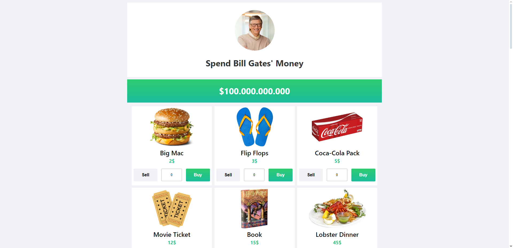
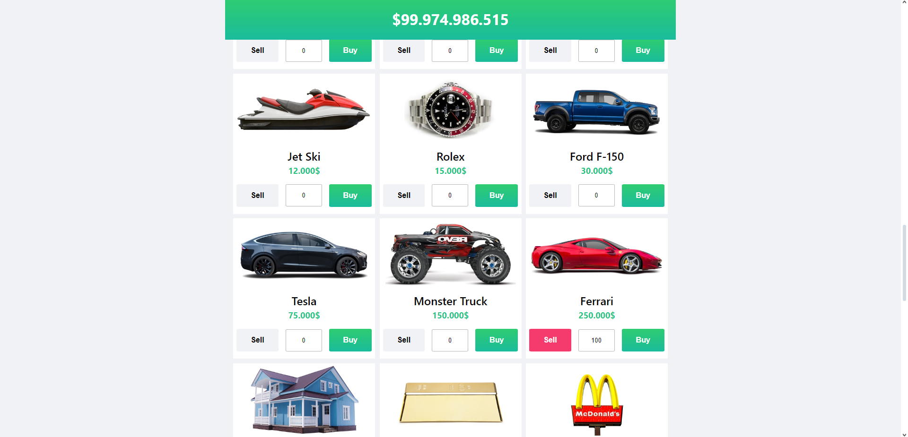
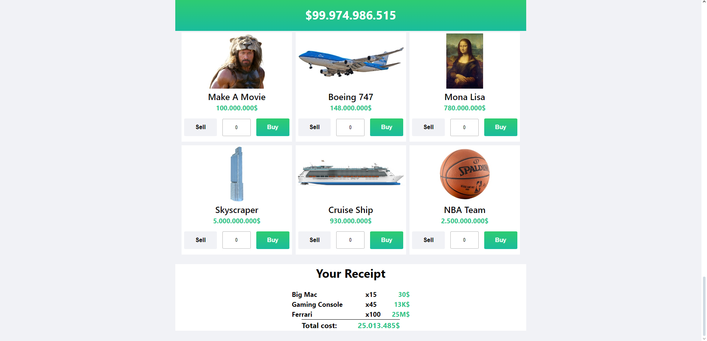

## Harcama Takip Uygulaması
Bu proje, kullanıcıların çeşitli ürünleri inceleyebileceği, seçebileceği ve toplam harcamalarını görebileceği interaktif bir harcama takip uygulamasıdır. React kullanılarak geliştirilmiş ve Netlify üzerinden yayınlanmıştır.

## Canlı İnceleme
Uygulamayı canlı olarak görüntülemek için aşağıdaki bağlantıya tıklayınız:
Canlı Demo

## Uygulama Ekran Görüntüleri
Uygulamanın farklı bölümlerine ait ekran görüntüleri aşağıda yer almaktadır:





## Kullanılan Teknolojiler

## Teknolojiler
Bu projede kullanılan başlıca teknolojiler şunlardır:

React: Kullanıcı arayüzlerinin geliştirilmesi için.
CSS: Uygulamanın stil ve tasarımının yönetilmesi için.
JavaScript: Uygulamanın işlevselliğini sağlamak için.
Netlify: Uygulamanın hosting ve dağıtımı için.
Proje Dosya Yapısı
Ana Bileşenler ve Dosyalar
item.js: Ürün bilgilerinin tutulduğu veri dosyası.
Receipt.jsx: Kullanıcının seçtiği ürünlerin ve toplam maliyetin gösterildiği fatura bileşeni.
receipt.css: Fatura bileşeninin stil dosyası.
ContextApi.jsx: Uygulamanın global durumunun yönetildiği Context API bileşeni.
Header.jsx: Uygulamanın üst kısmında yer alan başlık bileşeni.
header.css: Başlık bileşeninin stil dosyası.
ItemCards.jsx: Ürün kartlarının gösterildiği bileşen.
item-cards.css: Ürün kartlarının stil dosyası.
MoneyBar.jsx: Kullanıcının bütçesini ve harcamalarını gösteren bütçe çubuğu bileşeni.
money-bar.css: Bütçe çubuğu için stil dosyası.
index.css: Uygulamanın genel stil dosyası.
main.jsx: Uygulamanın giriş noktası.

## Kurulum ve Çalıştırma

Projeyi yerel ortamınızda çalıştırmak için aşağıdaki adımları takip edebilirsiniz:

1. Bu repoyu klonlayın:
    ```sh
    git clone
    ```

2. Proje dizinine gidin:
    ```sh
    cd 
    ```

3. Gerekli bağımlılıkları yükleyin:
    ```sh
    npm install
    ```

4. Uygulamayı başlatın:
    ```sh
    npm start
    ```

## Kullanım

Uygulama açıldıktan sonra, ürünleri seçip sepetinize ekleyebilir ve toplam harcamanızı görebilirsiniz.

